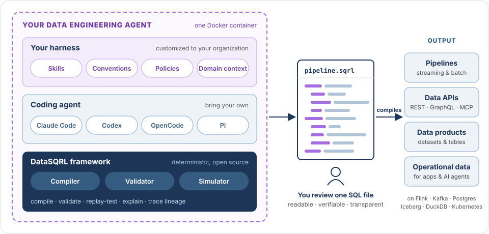

# DataSQRL: Agentic Data Engineering Harness

[](https://dl.circleci.com/status-badge/redirect/gh/DataSQRL/sqrl/tree/main)
[](https://datasqrl.github.io/sqrl)
[](https://codecov.io/gh/datasqrl/sqrl)
[](LICENSE)
[](https://hub.docker.com/r/datasqrl/cmd/tags)
[](https://repo1.maven.org/maven2/com/datasqrl/sqrl-root/)

**DataSQRL is an open-source harness for building data engineering agents designed around human control, correctness, and safety.**

It extends your coding agent of choice with a SQL compiler, validator, event-time simulator, and your own skills and policies. The result is a data engineering agent you can trust with pipelines, batch jobs, data APIs (REST, GraphQL, MCP), data products, and operational data.




## Why DataSQRL

### 1. Human Control: SQL You Understand

Agents build faster than humans can verify. DataSQRL is designed for human control and understanding so your data pipelines and applications don't become opaque liabilities.

Everything the agent builds, from ingest to transform to store to serve, is expressed as **declarative SQL scripts**. It's easy to follow the logic and concise enough to review in one sitting.

- **Review meaning, not plumbing.** Aggregations, units, filters, and joins sit on one screen. Reviewers can check that the pipeline does what was asked instead of skimming thousands of generated lines.
- **Run it yourself.** One command runs the whole pipeline locally, API included, so you can inspect real results and experiment quickly.
- **Build abstraction layers.** Extend with custom  UDFs, table functions, and operators that capture your business semantics.

Agents speed up the work. You still own the logic.

### 2. Compiler for Correctness and Introspection

A language model is a probabilistic tool that's prone to errors and hallucinations. DataSQRL provides a compiler that spans the entire data pipeline,  keeping types, names, keys, and schemas consistent across Flink, Kafka, Postgres, Iceberg, and an API layer.

- **Seams are generated.** Types, schemas, connector configs, API contracts, and identifier mappings are all derived from one logical model, so the systems cannot disagree.
- **Deep relational validation.** The validator walks the relational plan and catches bugs that are not visible in the query text: wrong or missing primary keys, changelogs treated as event streams, time-dependent joins, unbounded state, etc. Each error comes with a suggested fix the agent can act on.
- **Event-time replay testing.** The simulator runs the real deployment artifacts and replays events at their original timestamps. Late data, out-of-order events, races between streams, idle sources, updates, and deletes become deterministic test cases instead of production incidents.

### 3. Safety Guardrails You Can Inspect and Extend

Before anything is deployed, the compiler analyzes the whole data flow, and it writes out readable artifacts for physical and deployment plans.

- **Deep artifacts for governance.** Every compile produces the full computation DAG with table types, inferred keys, timestamps, schemas, and engine assignments, along with every deployment asset. Use these artifacts for data lineage, impact analysis, audit, and automated policy checks.
- **Scalable and fault-tolerant by design.** Deployment artifacts are compiled for robust operations with automatic index selection, partitioning, and fail-over. 
- **Security by construction.** API endpoints use parameterized queries, and authorization is bound to JWT claims in the SQL definition. 
- **Your policies enforced.** Add custom validation rules for PII handling, naming, retention, or data residency. Every pipeline the agent builds is checked against them automatically.

## Customize Your Harness

Every data organization has its own conventions, domain vocabulary, compliance requirements, and target infrastructure. DataSQRL is a **toolkit** you use to build a harness that honors those.

| Layer | What you customize                                                                                                                                               |
|---|------------------------------------------------------------------------------------------------------------------------------------------------------------------|
| **Skills** | How your team gathers requirements, plans, implements, tests, and deploys. Includes domain knowledge and data catalog context.                                   |
| **Validators & policies** | Custom compiler rules for governance, security, and data quality standards                                                                                       |
| **Functions & connectors** | Your UDFs, source and sink connectors, and data formats                                                                                                          |
| **Engines & deployment** | Your target infrastructure: Flink, Kafka, Postgres, Iceberg, and more, on Docker, Kubernetes, or managed cloud services. Extendable to the technologies you use. |
| **Coding agent** | Your choice: Claude Code, Codex, OpenCode, Pi, etc                                                                                                               |

Packaged into **one Docker container** which contains the data engineering agent that your teams, CI pipelines, and platforms can call.


## What DataSQRL Can Build Autonomously

- **Streaming and batch pipelines** on Flink, Kafka, and Iceberg, with CDC, temporal joins, windowed aggregations, and deduplication
- **Data APIs** with GraphQL, REST, and MCP endpoints generated from SQL table functions, including authentication and authorization
- **Data products** as curated, documented datasets and tables for analytics and downstream teams
- **Operational data** for applications and AI agents, including vector embeddings and LLM enrichment

The compiled deployment artifacts run on proven open-source technologies that you operate on existing Kubernetes or managed cloud services.

## Getting Started

Add the generic DataSQRL agent to your coding agent as a sub-agent for data engineering tasks:

**Prerequisites:** Docker running locally, an Anthropic credential (`ANTHROPIC_API_KEY` or `claude login`), and a git repository for your project. On Windows, use WSL.

**1. Install the plugin**

Claude Code:
```
/plugin marketplace add DataSQRL/datasqrl-plugin
/plugin install datasqrl@datasqrl
```

Codex:
```bash
codex plugin marketplace add DataSQRL/datasqrl-plugin
```

Cursor: point Cursor at `DataSQRL/datasqrl-plugin`. GitHub Copilot: clone [`DataSQRL/datasqrl-plugin`](https://github.com/DataSQRL/datasqrl-plugin) and run `./datasqrl-plugin/install-skills.sh /path/to/your/repo`.

The DataSQRL agent image is pulled automatically the first time you use it.

**2. Describe the pipeline you want**

In your project repository, tell your coding agent what you need in plain English:

> I want a pipeline that ingests our order data from Kafka and serves daily revenue per product through an API.

The plugin takes it from there:

1. Your agent writes a requirements document (`adr/requirements_<ts>.md`) with you.
2. The DataSQRL agent produces a plan (`adr/plan_<ts>.md`) for you to review.
3. Once you approve the plan, the DataSQRL agent runs the implement → compile → test → verify → refine loop until the tests pass.

An implementation run takes 30–60+ minutes and keeps going even if you close your session. Ask your agent how the run is going at any time (`/datasqrl:progress`). For small changes to an existing project, use `/datasqrl:patch`.

What you get is a SQRL script with its tests that you can read, run, and verify.

See the [plugin documentation](https://github.com/DataSQRL/datasqrl-plugin) for all skills, deployment to DataSQRL Cloud, and updating.

## Next steps
- [Getting Started tutorial](https://docs.datasqrl.com/docs/intro/getting-started)
- Look at examples of what DataSQRL can build:
  - [Collection of self-contained data products and APIs](https://github.com/DataSQRL/datasqrl-examples/)
  - [Complex enterprise example](https://github.com/datasqrl-colab/finance-demo) for a fictional bank, built from [a semantic data catalog](https://github.com/datasqrl-colab/finance-data-catalog-demo)
- Learn about the [architecture and motivation of the DataSQRL harness](https://docs.datasqrl.com/blog/agentic-data-engineering-harness)
- Use this codebase to build your own data engineering agent


## Contributing

We are building DataSQRL in the open so that every organization can run a data engineering agent that it understands, trusts, and controls.

Tell us what works and what doesn't by [filing an issue](https://github.com/DataSQRL/sqrl/issues) or starting a discussion. Code contributions are welcome. See [`CONTRIBUTING.md`](CONTRIBUTING.md).
