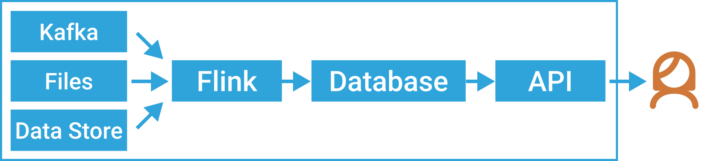

# DataSQRL

DataSQRL is an open-source compiler for multi-step data pipelines that generates the data plumbing code needed to integrate the steps in a pipeline.
DataSQRL compiles SQL plus an (optional) API definition into an optimized data pipeline that processes data according to the SQL transformations, serves the results through a database, and (optionally) exposes them through the API.

You declaratively define your data sources (in JSON), your data processing (in SQL), and optionally your data serving API (in GraphQL) which DataSQRL compiles to an integrated data pipeline.



DataSQRL has a pluggable engine model that supports technologies like Apache Kafka, Apache Flink, Postgres, and Eclipse Vert.x to execute the steps of the pipeline. The topology of the data pipeline is defined in a JSON package file which specifies the engines to use in the pipeline. DataSQRL's optimizer builds efficient data pipelines against the configured engines that optimizes physical data models, partitioning, view materialization vs. query execution, and data flow. <br /> 
DataSQRL has adapters for various data sources like Apache Kafka, file system, S3, etc. Additional engines and adapters can be added to the compiler (it's open-source, wink wink).

## Example

We are going to create a data pipeline that ingests temperature readings and aggregates them for realtime querying.

- Create a file `metrics.sqrl` and add the following content:

```sql title=metrics.sqrl
IMPORT datasqrl.example.sensors.SensorReading; -- Import metrics
IMPORT time.endOfSecond;  -- Import time function
/* Aggregate sensor readings to second */
SecReading := SELECT sensorid, endOfSecond(time) as timeSec,
                     avg(temperature) as temp
              FROM SensorReading GROUP BY sensorid, timeSec;
/* Get max temperature in last minute per sensor */
SensorMaxTemp := SELECT sensorid, max(temp) as maxTemp
                 FROM SecReading
                 WHERE timeSec >= now() - INTERVAL 1 MINUTE
                 GROUP BY sensorid;
```
- Invoke `docker run --rm -v $PWD:/build datasqrl/cmd compile metrics.sqrl` to compile the SQL script into a data pipeline with the executables located in the `build/deploy` directory.
- Run the entire data pipeline in docker with the command: `(cd build/deploy; docker compose up)`

Once the data pipeline is up and running, you can query the results through the default GraphQL API that DataSQRL generates. Open [http://localhost:8888/graphiql/](http://localhost:8888/graphiql/) in your browser and run GraphQL queries against the API. Once you are done, terminate the pipeline with the command: `(cd build/deploy; docker compose down -v)`

For a detailed explanation of this example, take a look at the [Quickstart Tutorial](https://www.datasqrl.com/docs/getting-started/quickstart) which shows you how to customize the API, create realtime alerts, and more.

## Documentation

* [Getting Started](https://www.datasqrl.com/docs/getting-started/overview/) gets you up and running with DataSQRL. 
* [User Documentation](https://www.datasqrl.com/docs/intro) the complete documentation for DataSQRL.
* [DataSQRL.com](https://www.datasqrl.com/) if you want to learn about DataSQRL in general.

## Key Contributions

Building data pipelines is more productive with DataSQRL because the compiler generates all the data plumbing required to integrate multi-step data pipelines: schema mapping, data flow orchestration, physical data modeling, query batching, etc. In addition, it determines the optimal allocation of resources in the compiled data pipeline and where to execute each data transformation (i.e. it optimizes partial view materialization, to use fancy database words) so the entire data pipeline can be implemented in one piece of code.

The goal for DataSQRL is to become a declarative framework for implementing pipelines of various topologies that abstracts away the data plumbing code required to stitch data pipelines together without limiting expressivity or flexibility.

## Current Limitations

DataSQRL is still very young and limited in the types of technologies and data sources/sinks it can support. Here are some of the rough edges to be aware of:

- DataSQRL has a pluggable infrastructure for "execution engines", i.e. the data systems that run the executables DataSQRL compiles for each step in the data pipeline. Currently, DataSQRL supports only [Apache Kafka](https://flink.apache.org/) as a data stream, [Apache Flink](https://flink.apache.org/) as a stream processor, [PostgreSQL](https://www.postgresql.org/) as a database, and [Vert.x](https://vertx.io/) as a API server. Additional execution engines will be added over time.
- DataSQRL has a pluggable infrastructure for data sources and sinks (i.e. the locations it ingests data from and writes data to) but currently supports only local and remote filesystems (like S3) and Apache Kafka.
- The DataSQRL optimizer currently uses a simple cost model and does not yet produce optimal results in all cases. DataSQRL supports SQL hints to manually overwrite the optimizer.
- DataSQRL does not yet support the entire SQL standard, specifically certain types of `WINDOW` queries and complex subqueries. We'll get there.

## Contributing


We are building DataSQRL because we want to enable data engineers to build data pipelines in a few days that currently take a team of technology experts weeks to implement. We want to get rid of all the data plumbing that's currently holding us back from rapidly building and iterating on data products. 

We hope that DataSQRL becomes an easy-to-use declarative framework for data pipelines. To make that happen we need your [feedback](https://discord.gg/49AnhVY2w9). Let us know if DataSQRL works for you and - more importantly - when it doesn't by filing GitHub issues. Become part of the [DataSQRL community](https://www.datasqrl.com/community).

We also love [code contributions](https://www.datasqrl.com/docs/dev/contribute). A great place to start is contributing a data source/sink implementation, data format, or schema so that DataSQRL has more adapters.

For more details, checkout [`CONTRIBUTING.md`](CONTRIBUTING.md).

