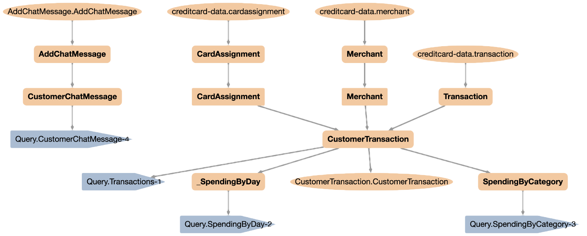
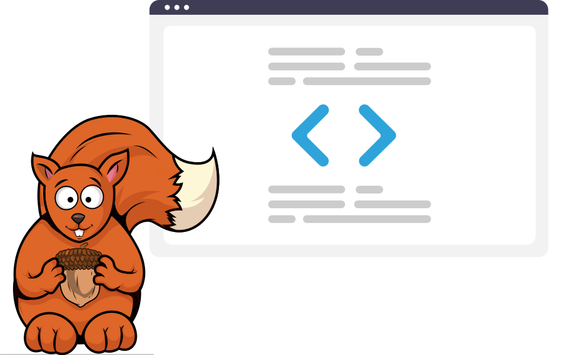

# DataSQRL

[](https://dl.circleci.com/status-badge/redirect/gh/DataSQRL/sqrl/tree/main)
[](https://datasqrl.github.io/sqrl)
<!--[](https://codecov.io/gh/datasqrl/sqrl) -->
[](LICENSE)
[](https://hub.docker.com/r/datasqrl/cmd/tags)
[](https://repo1.maven.org/maven2/com/datasqrl/sqrl-root/)

DataSQRL is a data automation framework for building reliable data pipelines, data APIs (REST, MCP, GraphQL), and data products in SQL using open-source technologies.

DataSQRL provides three key elements for AI-assisted data platform automation:
1. **World Model:** DataSQRL builds a source-to-sink computational graph of the data processing including schemas, connectors, and mappings, which provides a comprehensive world model to ground generative AI. 
2. **Simulation:** DataSQRL includes a runtime and testing framework to ensure data integrity and act as a simulator in iterative refinement loops with real-world feedback. 
3. **Verification:** Since the entire data pipeline is defined in SQL, it is easy to understand and verify. DataSQRL produces detailed execution plans and lineage graphs to assist automated and manual analysis. 

DataSQRL generates the deployment artifacts to execute the entire pipeline on open-source technologies like PostgreSQL, Apache Kafka, Apache Flink, and Apache Iceberg on your existing infrastructure with Docker, Kubernetes, or cloud-managed services.


DataSQRL models data pipelines with the following requirements:

* 🛡️ **Data Consistency Guarantees:** Exactly-once processing, data consistency across all outputs, schema alignment, and data lineage tracking.
* 🔒 **Production-grade Reliability:** Robust, highly available, scalable, secure, access-controlled, and observable data pipelines.
* 🚀 **Developer Workflow Integration:** Local development, quick iteration with feedback, CI/CD support, and comprehensive testing framework.

To learn more about DataSQRL, check out [the documentation](https://docs.datasqrl.com/).

## Example Implementation

The video demonstrates the interplay between DataSQRL and AI in building a data pipeline.

VIDEO


## Getting Started

To create a new data project with DataSQRL, use the `init` command.

```bash
 docker run --rm -v $PWD:/build datasqrl/cmd init api myproject
```
(Use `${PWD}` in Powershell on Windows).

This creates a new data API project called `myproject` in the local directory. 

<!-- Update below with init command -->

```sql title=myproject.sqrl
/*+no_query */
CREATE TABLE UserTokens (
    userid BIGINT NOT NULL,
    tokens BIGINT NOT NULL,
    request_time TIMESTAMP_LTZ(3) NOT NULL METADATA FROM 'timestamp'
);

/*+query_by_all(userid) */
TotalUserTokens := SELECT userid, sum(tokens) as total_tokens,
                          count(tokens) as total_requests
                   FROM UserTokens GROUP BY userid;

UsageAlert := SUBSCRIBE SELECT * FROM UserTokens WHERE tokens > 100000;
```

```bash
docker run -it --rm -p 8888:8888 -p 8081:8081 -v $PWD:/build datasqrl/cmd run usertokens.sqrl
``` 
(Use `${PWD}` in Powershell on Windows).

The pipeline results are exposed through an MCP Server at [http://localhost:8888/mcp/](http://localhost:8888/mcp) and GraphQL API that you can access at  [http://localhost:8888/graphiql/](http://localhost:8888/graphiql/) in your browser.

* `UserTokens` is exposed as a mutation and tool for adding data.
* `TotalUserTokens` is exposed as a query and tool for retrieving the aggregated data.
* `UsageAlert` is exposed as a subscription for real-time alerts.

Once you are done, terminate the pipeline with `CTRL-C`.

To build the deployment assets for the data pipeline, execute
```bash
docker run --rm -v $PWD:/build datasqrl/cmd compile usertokens.sqrl
``` 
The `build/deploy` directory contains the Flink compiled plan, Kafka topic definitions, PostgreSQL schema and view definitions, server queries, MCP tool definitions, and GraphQL data model. Those assets can be deployed in containerized environments (e.g. via Kubernetes) or cloud-managed services. 

Read the [full Getting Started tutorial](https://docs.datasqrl.com//docs/getting-started) or check out the [DataSQRL Examples repository](https://github.com/DataSQRL/datasqrl-examples/) for more examples creating MCP servers, data APIs, Iceberg views and more.

## Why DataSQRL?

AI-driven data platform automation is within reach. However, trust-worthy automation requires more than generative AI. It requires a [world model](https://lingo.csail.mit.edu/blog/world_models/) that understands your data landscape, enforces constraints, and provides the grounding and feedback loops needed for safe, reliable automation.

DataSQRL is an open-source world model for data platform automation. As a modular framework, it provides the building blocks to build a customized world model for your organization to give AI a set of guardrails that ensure generated solutions are safe, reliable, and perform well in production.

## How DataSQRL Works



DataSQRL is a modular compiler framework for data pipelines that (deterministically) automates a lot of data plumbing code in data pipelines. This significantly reduces the complexity of AI-assisted (i.e. probabilistic) automation and provides feedback through deep introspection of the pipeline code.

This allows you to generate data processing logic in SQL using any AI coding tools or agents.
DataSQRL compiles the SQL into a data processing DAG (Directed Acyclic Graph) according to the provided configuration. The analyzer traverses the DAG to detect potential data inconsistencies, performance, or scalability issues. The cost-based optimizer cuts the DAG into segments executed by different engines (e.g. Flink, Kafka, Postgres, Vert.x), generating the necessary physical plans, schemas, and connectors for a fully integrated, reliable, and consistent data pipeline. The compiled artifacts are fed back to the AI for iterative refinement to improve the solution incrementally.

In addition, the compiled deployment assets can be executed locally in Docker, Kubernetes, or by a managed cloud service. DataSQRL comes with a testing framework for simulation of the data pipeline. This provides real-world feedback on the results and operational characteristics that are included in the iterative refinement feedback loop.

DataSQRL gives you full visibility and control over the generated data pipeline. Since the entire pipeline is implemented in SQL it is easy to understand and verify manually.

DataSQRL uses proven open-source technologies to execute the generated deployment assets. You can use your existing infrastructure or cloud services for runtime, DataSQRL is only used at compile time. 

DataSQRL has a rich [function library](https://docs.datasqrl.com/docs/functions) and provides [connectors](https://docs.datasqrl.com/docs/connectors/) for many popular data systems (Kafka, Iceberg, Postgres, and many more). In addition, DataSQRL is an extensible framework, and you can add custom functions, source/sink connectors, and entire execution engines.

<!--
[DataSQRL Cloud](https://www.datasqrl.com) is a managed service that runs DataSQRL pipelines with no operational overhead and integrates directly with GitHub for simple deployments.
-->

Read an [in-depth explanation of DataSQRL](https://docs.datasqrl.com/blog/data-platform-automation) or view the [full documentation](https://docs.datasqrl.com/) to learn more.


## Contributing



Our goal is to automate data platforms by building a world model that provides the necessary guardrails and feedback. We believe anyone who can read SQL should be empowered to build complex data systems that are robust and reliable. Your feedback is invaluable in achieving this goal. Let us know what works and what doesn't by filing GitHub issues or starting discussions.

We welcome code contributions. For more details, check out [`CONTRIBUTING.md`](CONTRIBUTING.md).

