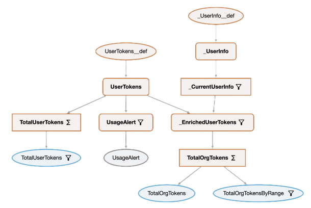
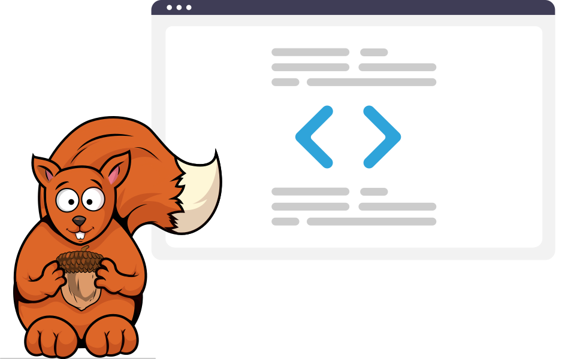

# DataSQRL: Agentic Data Engineering Harness

[](https://dl.circleci.com/status-badge/redirect/gh/DataSQRL/sqrl/tree/main)
[](https://datasqrl.github.io/sqrl)
<!--[](https://codecov.io/gh/datasqrl/sqrl) -->
[](LICENSE)
[](https://hub.docker.com/r/datasqrl/cmd/tags)
[](https://repo1.maven.org/maven2/com/datasqrl/sqrl-root/)

DataSQRL is an open-source **data engineering harness** that provides guardrails and feedback for AI coding agents to build reliable data pipelines, data APIs, and data products.

DataSQRL ensures coding agents meet the non-functional requirements of production data systems for data quality, scalability, governance, and reliability. DataSQRL provides deep-inspection of SQL, relational validators, and deterministic event-replay simulation to ensure agent-generated code meets these requirements through iterative feedback loops.


## Key Capabilities

DataSQRL provides three capabilities that coding agents need to produce production-grade data systems:

1. **Conceptual Framework**: A SQL-based logical layer grounded in relational algebra and stream processing, with a physical layer that maps to execution engines. Gives agents a precise vocabulary for reasoning about data transformations.

2. **Comprehensive Validation**: Verification at every level across syntax, schema, data flow semantics, physical plans, and deployment assets, with actionable error messages that guide agents toward correct solutions.

3. **Real-World Feedback**: A simulator for local testing with timestamp-accurate replay, plus production telemetry hooks that correlate runtime behavior back to source code for autonomous troubleshooting.

DataSQRL compiles SQL scripts into deployment artifacts for PostgreSQL, Apache Kafka, Apache Flink, and Apache Iceberg—running on your existing infrastructure with Docker, Kubernetes, or cloud-managed services.


## Getting Started

Create a new data project with the `init` command:

```bash
docker run --rm -v $PWD:/build datasqrl/cmd init api messenger
```
(Use `${PWD}` in Powershell on Windows)

This creates a data API project with sample data sources and a processing script called `messenger.sqrl`.

Run the project:
```bash
docker run -it --rm -p 8888:8888 -p 8081:8081 -v $PWD:/build datasqrl/cmd run messenger-prod-package.json
```

Access the API at [http://localhost:8888/v1/graphiql/](http://localhost:8888/v1/graphiql/). Add messages:

```graphql
mutation {
    Messages(event: {message: "Hello World"}) {
    message_time
  }
}
```

Query messages:
```graphql
{
    Messages {
    message
    message_time
  }
}
```

Also available via [REST](http://localhost:8888/v1/rest) or [MCP](http://localhost:8888/v1/mcp). Terminate with `CTRL-C`.

Instruct your favorite coding agent to update `messenger.sqrl` with test coverage and iterate until tests pass with:
```bash
docker run -it --rm -v $PWD:/build datasqrl/cmd test messenger-test-package.json
```

For example, to expose an endpoint for total messages:

```sql
TotalMessages := SELECT COUNT(*) as num_messages, MAX(message_time) as latest_timestamp
                 FROM Messages LIMIT 1;
```

Finally, compile deployment artifacts to deploy to Kubernetes or cloud services:
```bash
docker run --rm -v $PWD:/build datasqrl/cmd compile messenger-prod-package.json
```
The `build/deploy` directory contains Flink compiled plans, Kafka topic definitions, PostgreSQL schemas, server queries, MCP tool definitions, and GraphQL models—ready for Kubernetes or cloud deployment.

Read the [Getting Started tutorial](https://docs.datasqrl.com/docs/getting-started) or explore the [AI generated data products](https://github.com/datasqrl-colab/finance-demo) for a fictional bank based on [this catalog definition](https://github.com/datasqrl-colab/finance-data-catalog-demo) for a real-world inspired organizational use case.

## Why a Data Engineering Harness?

Coding agents can generate SQL queries that produce correct results on test data. But will those queries perform at scale? Handle late-arriving events correctly? Maintain data quality when upstream schemas change? Provide data lineage, governance, and meet compliance?

These non-functional requirements — data quality, scalability, governance, reliability, cost efficiency — are what distinguish data engineering from general software development. General-purpose coding agents aren't equipped to handle them consistently.

DataSQRL provides the guardrails, feedback loops, and domain-specific constraints that coding agents need. Without a harness, you get pipelines that work in demos but fail in production. With a harness, you get pipelines that embody data engineering best practices and domain-specific knowledge.

To see DataSQRL guiding an AI coding agent, [watch this demo](https://www.youtube.com/watch?v=RfMzdrtrEqQ).

## How It Works



DataSQRL is a harness and framework that deterministically automates data plumbing, reducing the complexity that coding agents must handle while providing feedback through deep introspection.

1. **Write SQL**: Define data transformations in SQRL (SQL with stream processing and API extensions)
2. **Compile**: DataSQRL builds a computational DAG, validates semantics, and optimizes execution
3. **Analyze**: The compiler detects data inconsistencies, performance issues, and capability mismatches
4. **Generate**: Cost-based optimization assigns operators to engines (Flink, Kafka, Postgres, Vert.x) and generates deployment artifacts
5. **Iterate**: Compilation output helps the agent refine its solution, while simulation provides real-world feedback

The entire pipeline is defined in SQL: easy to understand, verify, and maintain. DataSQRL handles the complex mapping to physical infrastructure so agents can focus on business logic. DataSQRL is compatible with any code agent and can be extended to incorporate organization knowledge and meet custom compliance requirements.

DataSQRL includes a [function library](https://docs.datasqrl.com/docs/functions) and [connectors](https://docs.datasqrl.com/docs/connectors/) for Kafka, Iceberg, Postgres, and more. The framework is extensible, add custom functions, connectors, or execution engines.

Read the [in-depth explanation](https://docs.datasqrl.com/blog/agentic-data-engineering-harness) or view the [full documentation](https://docs.datasqrl.com/).

## Contributing



Our goal is to build a data engineering harness that enables safe, reliable automation of data platforms. We believe anyone who can read SQL should be empowered to build complex data systems that are robust and production-ready.

Your feedback is invaluable. Let us know what works and what doesn't by filing GitHub issues or starting discussions.

We welcome code contributions. See [`CONTRIBUTING.md`](CONTRIBUTING.md) for details.
