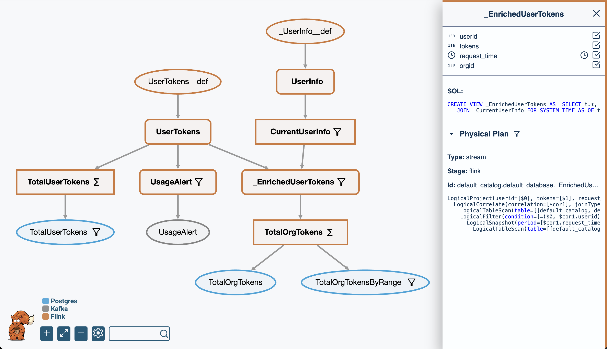

# DataSQRL

[](https://dl.circleci.com/status-badge/redirect/gh/DataSQRL/sqrl/tree/main)
[](https://datasqrl.github.io/sqrl)
[](https://codecov.io/gh/datasqrl/sqrl)
[](LICENSE)
[](https://hub.docker.com/r/datasqrl/cmd/tags)
[](https://repo1.maven.org/maven2/com/datasqrl/sqrl-root/)

DataSQRL is an open-source framework for building data pipelines in SQL: Build MCP servers, RAG pipelines, data APIs (GraphQL & REST), feature stores, and data products. Ingest, process, store, and serve data with a single SQL script.  

DataSQRL automates the construction of data pipelines from multiple sources of data with guaranteed consistency and reliability. DataSQRL eliminates data plumbing and empowers your team to focus on data enrichment instead of infrastructure and glue code.

Define the data processing and interface in SQL and DataSQRL generates an integrated data pipeline that runs on your existing infrastructure with Docker, Kubernetes, or cloud-managed services.


## DataSQRL Features

* 🛡️ **Data Consistency Guarantees:** Exactly-once processing, data consistency across all outputs, schema alignment, data lineage tracking, and comprehensive testing framework.
* 🔒 **Production-grade Reliability:** Robust, highly available, scalable, secure (JWT) and observable data pipelines executed by trusted OSS technologies (Kafka, Flink, Postgres, Apache Iceberg).
* 🤖 **Data Enrichment with AI:**  Joins across data sources, data cleansing, time-based processing, vector embeddings, LLM completions, ML model inference, complex aggregations, and custom functions.
* 🔗 **Realtime, Incremental, or Batch:** Flexibility to run realtime (millisecond), incremental (second to minutes), or batch updates without code changes. 
* 🚀 **Developer Workflow:** Local development, quick iteration with feedback, CI/CD support, logging framework, reusable components, and composable architecture for reliable pipeline management.

To learn more about DataSQRL, check out [the documentation](https://docs.datasqrl.com/).

## Example Implementations

The following examples show how to implement different types of data pipelines with DataSQRL for a fictional banking use case. We assume connections to operational banking systems to consume the `AccountHolders`, `Accounts`, and `Transactions` data. [DataSQRL Examples](https://github.com/DataSQRL/datasqrl-examples) contains the complete example with connector configuration and runtime instructions.

### MCP Server (LLM Tooling)

This DataSQRL script enriches transactions to provide an MCP tool for retrieving spending transactions. 

```sql
-- Ingest data from connected systems
IMPORT banking-data.AccountHoldersCDC; --CDC stream from masterdata
IMPORT banking-data.AccountsCDC;       --CDC stream from database
IMPORT banking-data.Transactions;      --Kafka topic for transactions
-- Convert the CDC stream of updates to the most recent version
Accounts := DISTINCT AccountsCDC ON account_id ORDER BY update_time DESC;
AccountHolders := DISTINCT AccountHoldersCDC ON holder_id ORDER BY update_time DESC;
-- Enrich debit transactions with creditor information using time-consistent join
SpendingTransactions := SELECT t.*, h.name AS creditor_name, h.type AS creditor_type
    FROM Transactions t JOIN Accounts FOR SYSTEM_TIME AS OF t.tx_time a ON t.credit_account_id=a.account_id
                        JOIN AccountHolders FOR SYSTEM_TIME AS OF t.tx_time h ON a.holder_id = h.holder_id;
-- Create secure MCP tooling endpoint with description for agentic retrieval
/** Retrieve spending transactions within the given time-range.
  fromTime (inclusive) and toTime (exclusive) must be RFC-3339 compliant date time.*/
SpendingTransactionsByTime(account_id STRING NOT NULL METADATA FROM 'auth.accountId',
    fromTime TIMESTAMP NOT NULL, toTime TIMESTAMP NOT NULL) :=
        SELECT * FROM SpendingTransactions WHERE debit_account_id = :account_id
        AND :fromTime <= tx_time AND :toTime > tx_time ORDER BY tx_time DESC;
```

This example defines a `SpendingTransactionsByTime` tool that is exposed through the MCP protocol and secured by JWT authentication.

### Context Retrieval (RAG)

This DataSQRL script extends the one above to aggregate transactions and build context for account holders and their accounts.

```sql
-- Define retrieval endpoint for holder's accounts
/*+query_by_all(holder_id) */
ActiveAccounts := SELECT * FROM Accounts WHERE status = 'active';
-- Aggregate spending by type for weeklong time windows that update every hour
_SpendingTimeWindow := SELECT debit_account_id AS account_id, creditor_type, window_start AS week,
                         window_time, SUM(amount) AS total_spending, COUNT(*) AS transaction_count
         FROM TABLE(CUMULATE(TABLE SpendingTransactions, DESCRIPTOR(tx_time),
                 INTERVAL '1' HOUR, INTERVAL '7' DAY))
         GROUP BY debit_account_id, creditor_type, window_start, window_end, window_time;
-- Provide access point to query spending summary for account
/*+query_by_all(account_id) */
SpendingByAccountTypeWeek := DISTINCT _SpendingTimeWindow ON account_id, creditor_type, week ORDER BY window_time;
```

This exposes two REST endpoints for `ActiveAccounts` and `SpendingByAccountTypeWeek` that are invoked to populate the context for financial chatbots and agents.

### GraphQL API

This DataSQRL script adds relationship definitions to define the structure of a GraphQL API that servers information on account holders, their accounts, and the transactions within.

```sql
-- Create a relationship between holder and accounts
AccountHolders.accounts(status STRING) := SELECT * FROM Accounts a WHERE a.holder_id = this.holder_id
                                          AND a.status = :status ORDER BY a.account_type ASC;
-- Relate accounts to spending summary by week
Accounts.spendingByWeek := SELECT * FROM SpendingByAccountTypeWeek s
                           WHERE s.account_id = this.account_id ORDER BY week DESC, creditor_type ASC;
-- Link accounts with spending transactions
Accounts.spendingTransactions(fromTime TIMESTAMP NOT NULL, toTime TIMESTAMP NOT NULL) :=
                           SELECT * FROM SpendingTransactions t
                           WHERE t.debit_account_id = this.account_id
                           AND :fromTime <= tx_time AND :toTime > tx_time ORDER BY tx_time DESC;
```

This exposes a flexible `graphql/` API for the frontend to query.

### Data Product (Iceberg Views)

This script enriches transactions with debitor and creditor account and holder information and exposes the result as a view in Apache Iceberg table format.

```sql
-- Enrich transactions with account information at the time of the transaction (e.g. balance)
_TransactionWithAccounts := SELECT t.*, ac.holder_id AS credit_holder_id, ac.account_type AS credit_account_type,
        ac.balance AS credit_account_balance, ad.holder_id AS debit_holder_id, ad.account_type AS debit_account_type,
                                   ad.balance AS debit_account_balance
    FROM Transactions t JOIN Accounts FOR SYSTEM_TIME AS OF t.tx_time ac ON t.credit_account_id=ac.account_id
                        JOIN Accounts FOR SYSTEM_TIME AS OF t.tx_time ad ON t.debit_account_id=ad.account_id;
-- Further enrich transactions with current account holder information and designate execution engine
/*+engine(iceberg) */
EnrichedTransactions := SELECT t.*, hc.name AS credit_holder_name, hc.type AS credit_holder_type,
                               hd.name AS debit_holder_name, hd.type AS debit_holder_type
    FROM _TransactionWithAccounts t JOIN AccountHolders hc ON t.credit_holder_id = hc.holder_id
                                    JOIN AccountHolders hd ON t.debit_holder_id = hd.holder_id;
-- Add a test case to validate the logic and avoid regressions
/*+test */
EnrichedTransactionsTest := SELECT debit_holder_name, COUNT(*) AS debit_tx_count, SUM(amount) AS total_debit_amount
                            FROM EnrichedTransactions
                            GROUP BY debit_holder_name ORDER BY debit_holder_name ASC;
```

The Iceberg view can be queried by data scientists and analysts in Spark, Trino, Snowflake, etc.

DataSQRL comes with a test framework for reproducible test cases that validate the accuracy of data processing and can be used to spot regressions in CI/CD pipelines.

## Getting Started

Let's build a data pipeline that captures user token consumption via API, exposes consumption alerts via subscription, and aggregates the data for agentic analysis via MCP tooling.

<!-- Add video tutorial -->

```sql title=usertokens.sqrl
/*+no_query */
CREATE TABLE UserTokens (
    userid BIGINT NOT NULL,
    tokens BIGINT NOT NULL,
    request_time TIMESTAMP_LTZ(3) NOT NULL METADATA FROM 'timestamp'
);

/*+query_by_all(userid) */
TotalUserTokens := SELECT userid, sum(tokens) as total_tokens,
                          count(tokens) as total_requests
                   FROM UserTokens GROUP BY userid;

UsageAlert := SUBSCRIBE SELECT * FROM UserTokens WHERE tokens > 100000;
```

Create a file `usertokens.sqrl` with the content above and run it with:

```bash
docker run -it --rm -p 8888:8888 -p 8081:8081 -v $PWD:/build datasqrl/cmd run usertokens.sqrl
``` 
(Use `${PWD}` in Powershell on Windows).

The pipeline results are exposed through an MCP Server at [http://localhost:8888/mcp/](http://localhost:8888/mcp) and GraphQL API that you can access at  [http://localhost:8888/graphiql/](http://localhost:8888/graphiql/) in your browser.

* `UserTokens` is exposed as a mutation and tool for adding data.
* `TotalUserTokens` is exposed as a query and tool for retrieving the aggregated data.
* `UsageAlert` is exposed as a subscription for real-time alerts.

Once you are done, terminate the pipeline with `CTRL-C`.

To build the deployment assets for the data pipeline, execute
```bash
docker run --rm -v $PWD:/build datasqrl/cmd compile usertokens.sqrl
``` 
The `build/deploy` directory contains the Flink compiled plan, Kafka topic definitions, PostgreSQL schema and view definitions, server queries, MCP tool definitions, and GraphQL data model. Those assets can be deployed in containerized environments (e.g. via Kubernetes) or cloud-managed services. 

Read the [full Getting Started tutorial](https://docs.datasqrl.com//docs/getting-started) or check out the [DataSQRL Examples repository](https://github.com/DataSQRL/datasqrl-examples/) for more examples creating MCP servers, data APIs, Iceberg views and more.

Read the [documentation](https://docs.datasqrl.com/) to learn how to configure the APIs, control the data processing, and extend the example to your needs.

## Why DataSQRL?

Building data pipelines that power MCP servers, RAG, data APIs and data products requires implementing and maintaining lots of tedious glue code. Making sure those data pipelines are robust, consistent, and governed requires diligent engineering work that delays project delivery and balloons cost. Updating data pipelines is error-prone, slowing iteration velocity. 

DataSQRL automates this distracting busywork with a principled SQL-based abstraction layer so you can focus on what matters: enriching your data and delivering to the customer.

## How DataSQRL Works



DataSQRL compiles the SQL scripts and data source/sink definitions into a data processing DAG (Directed Acyclic Graph) according to the configuration. The cost-based optimizer cuts the DAG into segments executed by different engines (e.g. Flink, Kafka, Postgres, Vert.x), generating the necessary physical plans, schemas, and connectors for a fully integrated, reliable, and consistent data pipeline. These deployment assets are then executed in Docker, Kubernetes, or by a managed cloud service.

DataSQRL gives you full visibility and control over the generated data pipeline and uses proven open-source technologies to execute the generated deployment assets. You can use your existing infrastructure or cloud services for runtime, DataSQRL is only used at compile time. 

DataSQRL has a rich [function library](https://docs.datasqrl.com/docs/functions) and provides [connectors](https://docs.datasqrl.com/docs/connectors/) for many popular data systems (Kafka, Iceberg, Postgres, and many more). In addition, DataSQRL is an extensible framework, and you can add custom functions, source/sink connectors, and entire execution engines.

<!--
[DataSQRL Cloud](https://www.datasqrl.com) is a managed service that runs DataSQRL pipelines with no operational overhead and integrates directly with GitHub for simple deployments.
-->

Learn more about DataSQRL in [the documentation](https://docs.datasqrl.com/).


## Contributing


Our goal is to simplify the development of data pipelines you can trust by automating the construction of robust and consistent data architectures. Your feedback is invaluable in achieving this goal. Let us know what works and what doesn't by filing GitHub issues or in the [DataSQRL Slack community]((https://join.slack.com/t/datasqrlcommunity/shared_invite/zt-2l3rl1g6o-im6YXYCqU7t55CNaHqz_Kg)).

We welcome code contributions. For more details, check out [`CONTRIBUTING.md`](CONTRIBUTING.md).

