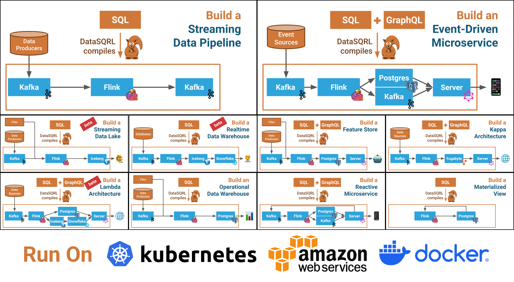

# DataSQRL

DataSQRL is a flexible data development framework for building various types of data architectures, like data pipelines, event-driven microservices, and Kappa. It provides the basic structure, common patterns, and a set of tools for streamlining the development process. 

DataSQRL integrates any combination of the following technologies:
* **Apache Flink:** a distributed and stateful stream processing engine.
* **Apache Kafka:** a distributed streaming platform.
* **PostgreSQL:** a reliable open-source relational database system.
* **Apache Iceberg:** an open table format for large analytic datasets.
* **Snowflake:** a scalable cloud data warehousing platform.
* **RedPanda:** a Kafka-compatible streaming data platform.
* **Yugabyte:** a distributed open-source relational database.
* **Vert.x:** a reactive server framework for building data APIs.

You define the data processing in SQL (with support for custom functions in Java, Scala and soon Python) and DataSQRL generates the glue code, schemas, and mappings to automatically connect and configure these components into a coherent data architecture. DataSQRL also generates Docker Compose templates for local execution or deployment to Kubernetes or cloud-managed services.

[](docs/img/datasqrl_use_cases.png)

Some of the data architectures you can build with DataSQRL. Click to enlarge.

## DataSQRL Features

* 🔗 **System Integration:** Combine various data technologies into streamlined data architectures.
* ☯️ **Declarative + Imperative:** Define the data flow in SQL and specific data transformations in Java, Scala, or soon Python.
* 🧪 **Testing Framework:** Automated snapshot testing.
* 🔄 **Data Flow Optimization:** Optimize data flow between systems through data mapping, partitioning, and indexing for scalability and performance.
* ✔️ **Consistent:** Ensure at-least or exactly-once data processing for consistent results across the entire system.
* 📦 **Dependency management:** Manage data sources and sinks with versioning and repository.
* 📊 **GraphQL Schema Generator:** Expose processed data through a GraphQL API with subscription support for headless data services. (REST coming soon)
* 🤖 **Integrated AI:** Support for vector data type, vector embeddings, LLM invocation, and ML model inference.
* { } **JSON Support:** Native JSON data type and JSON schema discovery.
* 🔍 **Visualization Tools:** Inspect and debug data architectures visually.
* 🪵 **Logging framework:** for observability and debugging.
* 🚀 **Deployment Profiles:** Automate the deployment of data architectures through configuration.

## Why DataSQRL?

Data engineers spend considerable time integrating various tools and technologies, ensuring performance, scalability, robustness, and observability. DataSQRL automates these tasks, making it easier to implement, test, debug, observe, deploy, and maintain data products. Like a web development framework, but for data. 

Our goal is to eliminate the data engineering busywork, so you can focus on building and iterating on data products.

## Getting Started

Let's create a data architecture that ingests, aggregates, stores temperature readings, and queries them through an API.

1. Create a file `metrics.sqrl` and add the following content:

```sql title=metrics.sqrl
IMPORT datasqrl.example.sensors.SensorReading; -- Import data source from repository
IMPORT time.endOfSecond;  -- Import time aggregation function
-- Aggregate sensor readings to second
SecReading := SELECT sensorid, endOfSecond(time) as timeSec,
                     avg(temperature) as temp
              FROM SensorReading GROUP BY sensorid, timeSec;
-- Get max temperature in last minute per sensor
SensorMaxTemp := SELECT sensorid, max(temp) as maxTemp
                 FROM SecReading
                 WHERE timeSec >= now() - INTERVAL 1 MINUTE
                 GROUP BY sensorid;
-- Log the SecReading table (stdout by default)
EXPORT SecReading TO logger.SecReadingDebug;
/*+test */
SensorMaxTempTest := SELECT * FROM SensorMaxTemp ORDER BY sensorid DESC;
```
2. Compile the SQRL file
```bash
docker run -it -rm -v $PWD:/build datasqrl/cmd compile metrics.sqrl
``` 
(Use `${PWD}` in Powershell on Windows).

3. Stand up the data architecture with Docker Compose:
```bash
(cd build/deploy; docker compose up --build)
``` 
4. Query results through the exposed GraphQL API:
   * Open [http://localhost:8888/graphiql/](http://localhost:8888/graphiql/) in your browser.
   * Run GraphQL queries against the API.

Once you are done, terminate the system with `CTRL-C` and take it down with `(cd build/deploy; docker compose down -v)`.

5. Test the data architecture (currently requires a homebrew install of DataSQRL via `brew tap datasqrl/sqrl; brew install sqrl-cli`):
```bash
sqrl test metrics.sqrl
```

This example uses the default engines, default configuration, and generated GraphQL schema. You can configure and change all of those to fit your needs. 

Check out the [DataSQRL Examples repository](https://github.com/DataSQRL/datasqrl-examples/) for more extensive examples. 

Dive into the [documentation](https://www.datasqrl.com/docs/intro/) or follow one of [the tutorials](https://www.datasqrl.com/docs/getting-started/quickstart/).

## How DataSQRL Works

DataSQRL extends ANSI SQL with additional features designed for data development:

* **IMPORT/EXPORT statements**: Integrate data sources and export data to sinks.
* **Assignment Operator (:=)**: Define incremental table structures.
* **Stream Processing SQL**: Enhanced SQL statements for stream processing.
* **Nested Structures**: Natively support nested data structures like JSON.


DataSQRL translates these SQL scripts into a data processing DAG (Directed Acyclic Graph) as visualized above, linking source and sink definitions. The cost-based optimizer cuts the DAG into segments executed by different engines (e.g. Flink, Kafka, Postgres, Vert.x), generating the necessary physical plans, schemas, and connectors for a fully integrated and streamlined data architecture. This "plan" can be instantiated by deployment profiles, such as Docker Compose templates for local execution. 

Check out the [documentation](https://www.datasqrl.com/docs/intro/) for more information.

## Contributing


We aim to enable data engineers to build data products quickly, removing the barriers posed by complex data plumbing. Your feedback is invaluable in achieving this goal. Let us know what works and what doesn't by filing GitHub issues or in the [DataSQRL Slack community]((https://join.slack.com/t/datasqrlcommunity/shared_invite/zt-2l3rl1g6o-im6YXYCqU7t55CNaHqz_Kg)).

We welcome code contributions. For more details, check out [`CONTRIBUTING.md`](CONTRIBUTING.md).

