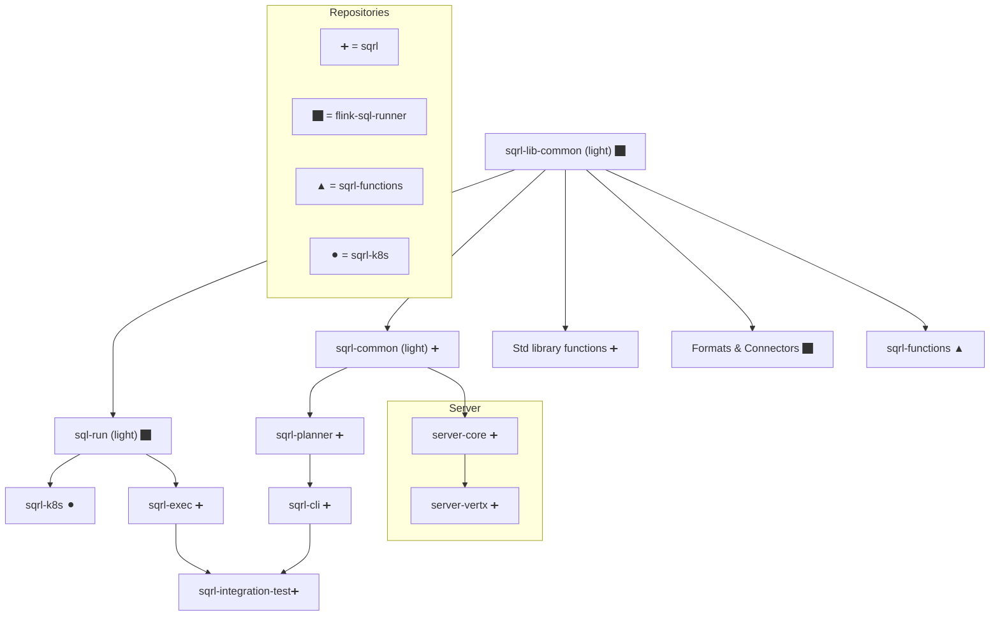

# Developer Documentation

The DataSQRL project consists of two parts:

* The DataSQRL build tool: Compiles SQRL script and (optional) API schema to an
  integrated data pipeline or event-driven microservice by producing the deployment
  assets for all components of the pipeline or microservice.
* The DataSQRL runtime components: libraries and components that are executed
  as part of a compiled data pipeline when the deployment assets are deployed or tested.

This repository contains the entire build tool implementation and parts of the runtime split across multiple modules.
Refer to the README.md file in each module for information on what this module contains and what its purpose is.

The following repositories contain additional runtime components:
* [Flink SQL Runner](https://github.com/DataSQRL/flink-sql-runner): Runs the Flink compiled plan and provides additional utilities for Flink.
* [SQRL K8s](https://github.com/DataSQRL/sqrl-k8s): A template for running DataSQRL pipelines in Kubernetes

:::warning
This page is slightly out of date and will be updated for 0.6 soon.
:::

The following diagram shows how the modules and repositories fit together:

## DataSQRL Build Tool

The goal of the DataSQRL build tool is simplifying the development of data pipelines
and event-driven microservices. Developers implement the logic of their
data product in SQL. The build tool compiles the SQL into an integrated
data pipeline that ingests, processes, stores, and serves the data as defined.

DataSQRL has its own variant of SQL called SQRL. SQRL extends SQL to allow
explicit imports and nested tables to represent hierarchical data natively. It
also provides some syntactic sugar to make it more convenient to develop with SQL.
Read the [SQRL specification](sqrl-language) for more details.

DataSQRL supports a pluggable engine architecture. A data pipeline or microservice
consists of multiple stages and each stage is executed by an engine.
For example, a data pipeline may consist of a stream processing, storage, and
serving stage which are executed by Apache Flink, PostgreSQL, and Vert.x, respectively.

DataSQRL supports the following types of stages:

* Stream Processing: For processing data as it is ingested
* Log: For moving data between stages reliably
* Database: For storage and querying data
* Server: For returning data through an API upon request
* Cache: For caching data on the server (coming soon)

A data pipeline topology is a sequence of stages. A pipeline topology may contain
multiple stages of the same type (e.g. two different database stages).
An engine is what executes the deployment assets for a given stage.
For example, the FlinkSQL generated by the compiler as part of the deployment assets for the "stream" stage is
executed by the Flink engine.

The pipeline topology as well as other compiler configuration options are
specified in a json configuration file typically called `package.json`.
The [configuration documentation](configuration.md) lists all the configuration options.

In addition to the compiler, the DataSQRL build tool contains a package manager
for resolving external data and
function dependencies, pre-processors for preparing dependencies, and post-processors
for refining the deployment artifacts produced by the compiler to the specified
engine configuration.

The DataSQRL build tool consists of the following components (i.e. java modules),
listed in the order in which they are invoked when compiling a SQRL script:

### CLI

#### Packager

The packager prepares the build directory for the compiler. The job of the
packager is to populate the `build` directory with all the files needed by the
compiler, so that the compiler can operate exclusively on the build directory and
have all the files it needs prepared in a standard way.

The packager
resolves external data and function dependencies that are imported in a script.
Those are either resolved against the local filesystem or downloaded from a repository
and placed into the build directory.

The packager also runs all registered pre-processors on the local directory
to pre-process input files and place them into the build directory for the
compiler. DataSQRL has a generic pre-processor framework.

[Link to packager module](sqrl-tools/sqrl-packager)

#### Command Line Interface

The DataSQRL build tool is accessed through a command line interface.
It defines all of the commands that DataSQRL supports and provides
usability features to help the user and produce useful error messages.
See the [CLI documentation](compiler) for more information.

[Link to cli module](sqrl-tools/sqrl-cli)

#### Discovery

The build tool contains a separate piece of functionality for data discovery.
The goal for data discovery is to make it easy for new users to get started
with DataSQRL by automatically generating table definitions for users' data.

This is implemented as a pre-processor that automatically extracts a schema
from `jsonl` and `csv` files and generates a table definition with connector
information for such files.

[Link to discovery module](sqrl-tools/sqrl-discovery)

### Planner

The planner parses a SQRL script, i.e. a sequence of SQL(ish) statements, analyzes
the statements, constructs a data processing DAG, optimizes the DAG, and finally
produces deployment assets for the engines executing the data processing steps.

[Link to planner module](sqrl-planner)

The planner consists of the following components.

#### Transpiler

The transpiler is the first stage of the compiler. The transpiler parses the
SQRL script into a logical plan by "translating" the SQRL specific SQL syntax
into FlinkSQL.

The transpiler resolves imports against the build directory using module loaders
that retrieve dependencies. It maintains a schema of all defined tables
in a SQRL script. It also parses the API specification and maps the API schema
the table schemas.

The transpiler is build on top of Apache Calcite by way of FlinkSQL for all SQL handling.
It prepares the statements that are analyzed and planned by the planner

#### Logical Plan Analyzer

The logical plan analyzer is the second stage of the compiler. It takes the
logical plan (i.e. Relnode) produced by the transpiler for each table or function
defined in the SQRL script and analyzes the logical plan to extract a TableAnalysis
that contains information needed by the planner.

1. It keeps track of important metadata like timestamps, primary keys, sort orders, etc
2. It analyzes the SQL to identify potential issues, semantic inconsistencies, or optimization potential and produces warnings or notices.
3. It extracts cost information for the optimizer.

#### DAG Planner

The DAG planner takes all the individual table and function definitions and assembles them into
a data processing DAG (directed acyclic graph). It prunes the DAG and rewrites the DAG before optimizing the
DAG to assign each node (i.e. table or function) to a stage in the pipeline.

The optimizer uses a cost model and is constrained to produce only viable
pipelines.

At the end of the DAG planning process, each table or function defined in the SQRL script
is assigned to a stage in the pipeline.

#### Physical Planner

All the tables in a given stage are then passed to the stage engine's physical
planner which produces the physical plan for the engine that has been
configured to execute that stage.

Physical planning can contain additional optimization such as selecting optimal index
structures for database tables.

The physical planner is also responsible for generating the API schemas (e.g. GraphQL schema)
for the exposed API if the pipeline contains a server engine. Optionally, the user may
provide the API schema in which case the physical planner validates the schema and maps it
to the SQRL script.

The physical plans are then written out as deployment artifacts to the `build/plan`
directory.

### Testing

Integration tests for the DataSQRL build tool can be found in
`sqrl-testing/sqrl-integration-tests`

## DataSQRL Runtime

The DataSQRL project also contains some runtime components that get executed
as part of the data pipeline compiled by the DataSQRL build tool:

### Server

The server module contains the default server implemented based on Vert.x.
The server takes a configuration file as input which maps each API entry point
to a single or set of SQL queries that are executed against the database on
request.

The server processes mutations by creating events and persisting them to a log.
The server handles subscriptions by listening to new log events and forwarding
them to clients.

The configuration file that defines the behavior of the server is a
deployment asset produced by the DataSQRL build tool for the "server" stage.

### Flink Libraries

DataSQRL extends the standard SQL function library with many additional function
modules. Those are executed at runtime in Flink or on the server.
The functions are iplemented in the `sqrl-flink-lib` module.

It also contains custom formats and connectors for Flink that extend
existing formats and connectors to support functionality needed by DataSQRL.
It may be reasonable to contribute those improvements and extensions back to
the Apache Flink project.

# Functions

SQRL adds additional functions to the standard SQL function catalog.

Functions in SQRL are designed to be engine-agnostic, ensuring that their implementation is consistent across different platforms and execution environments. This uniformity is crucial for maintaining the semantic integrity of functions when executed under various systems.

**Characteristics of Functions**
- **Engine Agnosticism**: Functions are defined in a way that does not depend on the specifics of the underlying engine.
- **Semantic Consistency**: Regardless of the engine used, function should preserve their semantic meaning.
- **Mixed Engine Support**: While functions are designed to be widely supported, some may have mixed support depending on the engine's capabilities.
- **Nullability Awareness**: Functions in SQRL retain nullability information. This feature is vital for correct schema generation downstream, ensuring that data integrity is maintained through the potential propagation of null values.

:::warn
This documentation is work-in-progress. SQRL does not yet support function mappings for all engines. Stay tuned.
:::