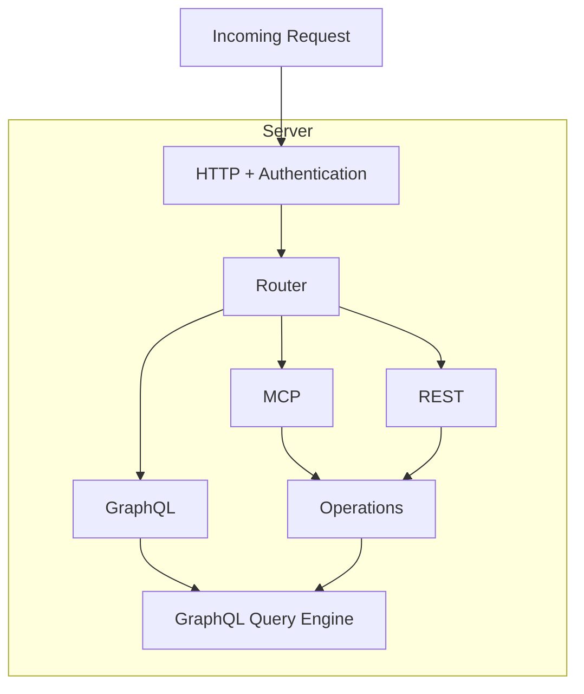

# Designing the Interface

Based on the SQRL script, DataSQRL generates the interface for the compiled data pipeline. DataSQRL supports the following interfaces:

* Data Product (Data Lake Views and Database Views)
* GraphQL (Mutations, Queries, and Subscriptions)
* MCP (Tooling and Resources)
* REST (GET and POST)

For data products, DataSQRL generates view definitions as deployment assets in `build/deploy/plan` which can be queried directly.

The last three are APIs that can be invoked programmatically. The `protocols` [compiler configuration](configuration.md#compiler-compiler) controls which API protocols are exposed by the server.

## Data Products

For data products, each visible table defined in the SQRL script is exposed as a view or physical table depending on the pipeline optimization. The mapping between visible tables in the SQRL script and exposed tables in the interface is 1-to-1.

We recommend generating unique table names for the physical tables by configuring a table-name suffix in the [connector configuration](configuration-default), e.g. by configuring the `table-name` for `postgres` or the `catalog-table` for `iceberg` to `${sqrl:table-name}_MY_SUFFIX` . This separates views from physical tables to provide modularity and support updates without impacting downstream consumers. 

## APIs

When a server engine is configured, the tables, relationships, and functions defined in a SQRL script map to API endpoints exposed by the server.
DataSQRL builds an object-relationship model from the tables and relationships between them. Tables are mapped to objects with each scalar column as a field. Fields that are nested rows are mapped to child objects with field name as the parent-to-child relationship. Relationships defined between tables are mapped to relationships between the corresponding objects.

### GraphQL

DataSQRL uses the GraphQL data model as the base model for all API access to data because there is a natural 1-to-1 mapping between the object-relationship model of a SQRL project and GraphQL schema:
Each object maps to a type or input and each relationship maps to a relationship field on the respective types.

#### Model-to-Schema Mapping

Specifically, tables and functions are exposed as query endpoints of the same name and argument signature (i.e. the argument names and types match).
Tables/functions defined with the `SUBSCRIBE` keyword are exposed as subscriptions.
Internal table sources are exposed as mutations with the input type identical to the columns in the table excluding computed columns.

In addition, the result type of the endpoint matches the schema of the table or function. That means, each field of the result type matches a column or relationship on the table/function by name and the field type is compatible.
The field type is compatible with the column/relationship type iff:
* For scalar or collection types there is a native mapping from one type system to the other
* For structured types (i.e. nested or relationship), the mapping applies recursively.

#### Base Tables

To avoid generating multiple redundant result types in the API interface, the compiler infers the base table for each defined table and function.

The base table for a defined table or function is the right-most table in the relational tree of the SELECT query from the definition body if and only if that table type is equal to the defined table type. If no such table exists, the base table is the table itself.

The result type for a table or function is the result type generated for that table's base table.
Hidden columns, i.e. columns where the name starts with an underscore `_`, are not included in the generated result type.

#### Schema Generation

The compiler generates the GraphQL schema automatically from the SQRL script if no API schema is defined in the [`package.json`](configuration). Add the `--api graphql` flag to the [`compile` command](compiler.md#compile-command) to write the schema to the `schema.v1.graphqls` file in the same directory for inspection or fine-tuning.

#### Schema Customization

If a GraphQL schema is defined, the compiler maps the object-relationship model onto the provided schema. You can write your own GraphQL schema or modify the generated GraphQL schema to control the exposed interface. Any modifications must preserve the mapping to the object-relationship model described above.

You can customize the GraphQL schema by:
* Changing field cardinalities (e.g. `[Person]!` to `Person!`)
* Changing scalar types (e.g. `Long` to `Int`)
* Changing the argument name for mutations (e.g. `event` to `payload`)
* Changing the type of fields to compatible types (e.g. `Person` to `SpecificPerson`)
* Adding enums
* Adding interfaces and structuring types with interfaces

:::warning
The compiler raises errors when the provided GraphQL schema is not compatible with the object-relationship model.
:::

#### Authoritative Model

DataSQRL uses the GraphQL schemas the authoritative model for all API protocols. It serves as the foundational model on which operations, endpoints, and access patterns are defined. This simplifies the conceptual model and server execution since any API operation maps to a GraphQL query which is executed by a centralized and optimized GraphQL engine.

The GraphQL query execution engine sits at the core of the DataSQRL server engine and executes all requests even if the GraphQL API is not exposed. This ensures uniform execution of all requests and a shared authentication and authorization mechanism for security.



### MCP and REST

DataSQRL exposes an endpoint in MCP or REST for each GraphQL operation.
DataSQRL generates a list of operations from the GraphQL schema: one for each query and mutation endpoint. 
* Queries are mapped to MCP tools with a `Get` prefix and REST endpoints under `rest/queries`. If the arguments are simple scalars, the REST endpoint is GET with URL parameters, otherwise POST with the arguments as payload. For the result set, DataSQRL follows relationship fields up to a configured depth `max-result-depth` (and without loops).
* Mutations are mapped to MCP tools with an `Add` prefix and REST POST endpoints under `rest/mutations`.

For complete control over the exposed MCP tools and resources as well as REST endpoints, you can define the GraphQL operations explicitly in one or multiple `.graphql` files which configured under `operations` in the [`package.json`](configuration).

The GraphQL file defining the operations contains named queries or mutations.
The name of the operation is the name of the MCP tool and REST endpoint and must be unique.

The `@api` directive is applied to the directive to control how the operation is exposed:
* `rest`: `NONE`, `GET`, or `POST` to configure the HTTP method or not expose as REST endpoint.
* `mcp`: `NONE`, `TOOL`, or `RESOURCE` to configure how the query is exposed in MCP.
* `uri`: AN RFC 6570 template to configure the REST path and MCP resource path. Any operation arguments that are not defined in the uri template are considered part of the payload for REST (and the method must be POST).

```graphql
query GetPersonByAge($age: Int!) @api(rest: GET, mcp: TOOL, uri: "/queries/personByAge/{age}") {
    Person(age: $age, limit: 10, offset: 0) {
        name
        email
    }
}
```

This defines an operation `GetPersonByAge` which is the name of the MCP tool and REST endpoint with the path `/queries/personByAge/{age}` using GET method.

By default, DataSQRL will add the custom operations to the generated ones. To only expose explicitly defined operations set `endpoints` option to `OPS_ONLY` in the [`package.json`](configuration).

### Testing

DataSQRL's automated testing via the [`test` command](compiler#test-command) executes all GraphQL queries inside the [configured](configuration) `test-folder` and snapshots the returned results. Queries are executed in this order:

1. All subscription queries are registered
2. Mutations are executed sequentially in alphabetical order of filename. The test runner waits the configured `mutation-delay-sec` between mutations. Results are written as snapshots to the snapshot folder.
3. The test runner waits until the configured timeout.
4. Queries are executed and results written as snapshots.
5. All subscription results are sorted and written as snapshots.

If a snapshot already exists, results are compared and the test fails if they are unequal.

The test runner uses the configured `headers` for accessing the API. To test authentication and authorization with different access tokens, create a properties file with the same name as the GraphQL file to configure header properties per query.

For example, if your test folder contains `myquery.graphql` you can configure custom headers for this query in `myquery.properties`:
```text
Authorization: Bearer XYZ
```