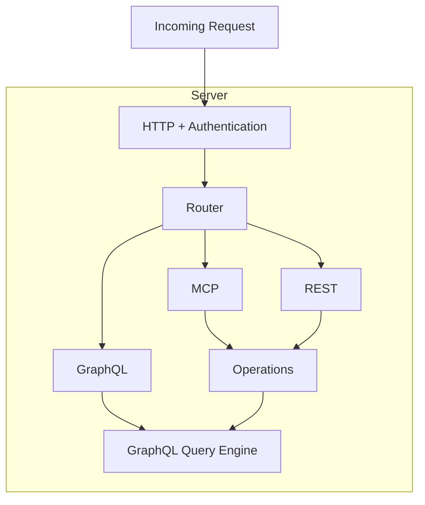

# Designing the Interface

Based on the SQRL script, DataSQRL generates the interface for the compiled data pipeline. DataSQRL supports the following interfaces:

* Data Product (Data Lake Views and Database Views)
* GraphQL (Mutations, Queries, and Subscriptions)
* MCP (Tooling and Resources)
* REST (GET and POST)

For data products, DataSQRL generates view definitions as deployment assets in `build/deploy/plan` which can be queried directly.

The last three are APIs that can be invoked programmatically. Every compiled API model is served through GraphQL.
The `protocols` [compiler configuration](configuration.md#compiler-compiler) controls whether generated operations are exposed through REST and MCP.

## Data Products

For data products, each visible table defined in the SQRL script is exposed as a view or physical table depending on the pipeline optimization. The mapping between visible tables in the SQRL script and exposed tables in the interface is 1-to-1.

We recommend generating unique table names for the physical tables by configuring a table-name suffix in the [connector configuration](configuration-default), e.g. by configuring the `table-name` for `postgres` or the `catalog-table` for `iceberg` to `${sqrl:table-name}_MY_SUFFIX` . This separates views from physical tables to provide modularity and support updates without impacting downstream consumers. 

## APIs

When a server engine is configured, the tables, relationships, and functions defined in a SQRL script map to API endpoints exposed by the server.
DataSQRL builds an object-relationship model from the tables and relationships between them. Tables are mapped to objects with each scalar column as a field. Fields that are nested rows are mapped to child objects with field name as the parent-to-child relationship. Relationships defined between tables are mapped to relationships between the corresponding objects.

### GraphQL

DataSQRL uses the GraphQL data model as the base model for all API access to data because there is a natural 1-to-1 mapping between the object-relationship model of a SQRL project and GraphQL schema:
Each object maps to a type or input and each relationship maps to a relationship field on the respective types.

#### Model-to-Schema Mapping

Specifically, tables and functions are exposed as query endpoints of the same name and argument signature (i.e. the argument names and types match).
Tables/functions defined with the `SUBSCRIBE` keyword are exposed as subscriptions.
Internal table sources are exposed as mutations with the input type identical to the columns in the table excluding computed columns.

In addition, the result type of the endpoint matches the schema of the table or function. That means, each field of the result type matches a column or relationship on the table/function by name and the field type is compatible.
The field type is compatible with the column/relationship type iff:
* For scalar or collection types there is a native mapping from one type system to the other
* For structured types (i.e. nested or relationship), the mapping applies recursively.

#### Base Tables

To avoid generating multiple redundant result types in the API interface, the compiler infers the base table for each defined table and function.

The base table for a defined table or function is the right-most table in the relational tree of the SELECT query from the definition body if and only if that table type is equal to the defined table type. If no such table exists, the base table is the table itself.

The result type for a table or function is the result type generated for that table's base table.
Hidden columns, i.e. columns where the name starts with an underscore `_`, are not included in the generated result type.

#### Schema Generation

If no GraphQL schema is configured, the compiler infers one from the SQRL script and writes it to `build/inferred_schema.graphqls`.

To provide and customize a schema for the default `v1` API, configure its path as `script.graphql` in [`package.json`](configuration.md#source-files-script).
To serve multiple API versions, configure each version and its required schema under `script.api`. See [API Versioning](configuration.md#api-versioning).

A useful customization workflow is to compile without a configured schema, copy `build/inferred_schema.graphqls` into the project (for example, `api/schema.v1.graphqls`), then configure that file as the API schema.

#### Schema Customization

If a GraphQL schema is defined, the compiler maps the object-relationship model onto the provided schema. You can write your own GraphQL schema or modify the generated GraphQL schema to control the exposed interface. Any modifications must preserve the mapping to the object-relationship model described above.

You can customize the GraphQL schema by:
* Changing field cardinalities (e.g. `[Person]!` to `Person!`)
* Changing scalar types (e.g. `Long` to `Int`)
* Changing the argument name for mutations (e.g. `event` to `payload`)
* Changing the type of fields to compatible types (e.g. `Person` to `SpecificPerson`)
* Adding enums
* Adding interfaces and structuring types with interfaces

:::warning
The compiler raises errors when the provided GraphQL schema is not compatible with the object-relationship model.
:::

#### Pagination

Every generated query endpoint takes `limit` and `offset` arguments to page through the result (`limit` defaults to the configured `default-limit`). By default the endpoint returns the rows directly and the client tracks the offsets itself.

Set `paginated-results` to `true` in the [`api` compiler configuration](configuration.md#compiler-compiler) to get pagination metadata alongside the rows. The generated schema then wraps every multi-row query result in a page type:

```graphql
type PersonPage {
  results: [Person!]
  pagination: OffsetPageInfo
}

type OffsetPageInfo {
  pageSize: Int!
  currentPage: Int!
  totalRecords: Long!
  totalPages: Int!
  hasNextPage: Boolean!
  hasPreviousPage: Boolean!
  nextOffset: Int
  prevOffset: Int
  firstEventTime: DateTime
  lastEventTime: DateTime
}
```

A query then selects the rows and the metadata it needs:

```graphql
query GetPeople {
  Person(limit: 10, offset: 20) {
    results { name email }
    pagination { currentPage hasNextPage nextOffset }
  }
}
```

`firstEventTime` and `lastEventTime` are the earliest and latest event time of the *entire* result set, not of the returned page. They are `null` when the query result has no event time (rowtime) column.

If you provide your own GraphQL schema, pagination is opt-in per query: give the query a result type with exactly two fields — a list of the result type, and a field of type `OffsetPageInfo` — and declare `OffsetPageInfo` exactly as shown above. The field names of the wrapper type are up to you. The compiler validates that:
* the `OffsetPageInfo` type is declared and matches the definition above
* the paginated query declares both a `limit` and an `offset` argument
* the query returns multiple rows (i.e. it is not restricted to a single row) and is a query, not a subscription

The server computes only the metadata a request actually selects, so paginated queries cost no more than unpaginated ones unless you ask for more:
* `pageSize`, `currentPage`, `hasPreviousPage`, and `prevOffset` are derived from the request arguments and cost nothing.
* `hasNextPage` and `nextOffset` make the query fetch one extra row, which is discarded before the results are returned. Without a `limit` argument the page holds every remaining row and `hasNextPage` is `false`.
* `firstEventTime` and `lastEventTime` run a second `MIN`/`MAX` query over the event time column. The compiler adds an index on that column for paginated queries.
* `totalRecords` and `totalPages` run a `COUNT(*)` over the entire result set, ignoring `limit`/`offset`.

Selecting event times and totals together costs a single combined aggregate query, not two, so a request never makes more than one extra round trip.

:::warning
`totalRecords` and `totalPages` are expensive: the `COUNT(*)` behind them cannot be answered from the page the request asked for and generally requires a full table scan, which gets slower as the table grows. Select them only when the client really needs an exact total, and prefer `hasNextPage`/`nextOffset` for plain "is there more?" paging.
:::

#### Authoritative Model

DataSQRL uses the GraphQL schema as the authoritative model for all API protocols. It is the foundation for operations, endpoints, and access patterns.
This simplifies the conceptual model and server execution since any API operation maps to a GraphQL query which is executed by a centralized and optimized GraphQL engine.

The GraphQL query execution engine sits at the core of the DataSQRL server engine and executes all requests even if the GraphQL API is not exposed. This ensures uniform execution of all requests and a shared authentication and authorization mechanism for security.


```mermaid
flowchart TD
    A[Incoming Request] --> B[HTTP + Authentication]
    B --> C[Router]
    
    C --> D[GraphQL]
    C --> E[REST]
    C --> F[MCP]
    
    F --> G[Operations]
    E --> G
    D --> H[GraphQL Query Engine]
    G --> H
    
    subgraph Server
        B
        C
        D
        E
        F
        G
        H
    end
```

### MCP and REST

DataSQRL exposes MCP and REST endpoints by converting GraphQL operations. With the default `compiler.api.endpoints: "FULL"`, it also generates one operation for each query and mutation field in the GraphQL schema.

* Generated queries are mapped to GET REST endpoints under `rest/queries`; generated mutations are mapped to POST REST endpoints under `rest/mutations`. For generated result sets, DataSQRL follows relationship fields up to the configured `max-result-depth` without loops.
* When `add-prefix` is enabled (the default), generated query and mutation operations are named with `Get` and `Add` prefixes respectively. MCP exposes eligible generated operations as tools.

For complete control over the exposed MCP tools and resources as well as REST endpoints, define named GraphQL queries or mutations in one or more `.graphql` files configured under `script.operations` (or a version's `script.api.<version>.operations`) in [`package.json`](configuration.md#source-files-script).

The GraphQL file defining the operations contains named queries or mutations.
The name of the operation is the name of the MCP tool and REST endpoint and must be unique.

Apply the `@api` directive to an operation to control how it is exposed:
* `rest`: `NONE`, `GET`, or `POST` to configure the HTTP method or not expose as REST endpoint.
* `mcp`: `NONE`, `TOOL`, or `RESOURCE` to configure how the query is exposed in MCP.
* `uri`: AN RFC 6570 template to configure the REST path and MCP resource path. Any operation arguments that are not defined in the uri template are considered part of the payload for REST (and the method must be POST).

```graphql
""" Returns up to 10 people for a given age """
query GetPersonByAge($age: Int!) @api(rest: GET, mcp: TOOL, uri: "/queries/personByAge/{age}") {
    Person(age: $age, limit: 10, offset: 0) {
        name
        email
    }
}
```

This defines an operation `GetPersonByAge` which is the name of the MCP tool and REST endpoint with the path `/queries/personByAge/{age}` using GET method.

The doc strings for the operations are used in the API and tooling documentation.

By default, DataSQRL adds explicit operations to the generated ones. Set `compiler.api.endpoints` to `OPS_ONLY` in the [`package.json`](configuration) to omit generated MCP and REST operations. The GraphQL endpoint remains available.

### OpenAPI

OpenAPI describes the REST API derived from GraphQL operations. It is not a second API definition.
For every compiled API version, DataSQRL generates an OpenAPI 3 document from operations that expose a REST endpoint.
The document includes REST paths, parameters, request bodies, and response schemas, but does not describe the GraphQL or MCP endpoints.

The generated specification is packaged as `build/deploy/plan/vertx-<version>-openapi.json`.
With the default Vert.x server configuration and at least one REST operation, it is served at `/v1/openapi` and Swagger UI is served at `/v1/swagger-ui`.
Set `engines.vertx.config.openApiConfig.enabled` to `false` to disable those runtime documentation endpoints.
The same configuration can customize the documentation endpoints and metadata, including `endpoint`, `uiEndpoint`, `title`, `description`, `version`, contact details, and license details.
Compilation still generates the specification artifact.

### GraphQL and OpenAPI Configuration

GraphQL defines each API version, and OpenAPI is generated from that version's REST operations.
The configuration determines which GraphQL schema is used and whether compilation checks the generated OpenAPI specification for backward compatibility.

The `script.api.<version>.openapi` field points to a previously generated OpenAPI document for that compatibility check.
It is not used as the served specification and does not define or customize the API.

| `package.json` configuration                     | GraphQL schema              | OpenAPI behavior                                                                                                       |
|--------------------------------------------------|-----------------------------|------------------------------------------------------------------------------------------------------------------------|
| Neither `script.graphql` nor `script.api`        | Inferred as `v1`            | A `v1` OpenAPI artifact is generated; no compatibility check runs.                                                     |
| `script.graphql`                                 | Configured as `v1`          | A `v1` OpenAPI artifact is generated; no compatibility check runs.                                                     |
| `script.api.<version>.schema`                    | Configured for each version | An OpenAPI artifact is generated for each version.                                                                     |
| `script.api.<version>.schema` and `.openapi`     | Configured for each version | The generated specification is compared with the configured prior document; compilation fails on incompatible changes. |
| `script.api.<version>.openapi` without `.schema` | None                        | Invalid configuration: every `script.api` version requires `schema`.                                                   |

Use the versioned `script.api` form when you need OpenAPI compatibility checks. When `script.api` is present, it defines the API versions to compile and serve.
The top-level `script.graphql` and `script.operations` are not used for those versions.

### Testing

DataSQRL's automated testing via the [`test` command](compiler#test-command) executes all GraphQL queries inside the [configured](configuration) `test-folder` and snapshots the returned results. Queries are executed in this order:

1. All subscription queries are registered
2. Mutations are executed sequentially in alphabetical order of filename. The test runner waits the configured `mutation-delay-sec` between mutations. Results are written as snapshots to the snapshot folder.
3. The test runner waits until the configured timeout.
4. Queries are executed and results written as snapshots.
5. All subscription results are sorted and written as snapshots.

If a snapshot already exists, results are compared and the test fails if they are unequal.

The test runner uses the configured `headers` for accessing the API. To test authentication and authorization with different access tokens, create a properties file with the same name as the GraphQL file to configure header properties per query.

For example, if your test folder contains `myquery.graphql` you can configure custom headers for this query in `myquery.properties`:
```text
Authorization: Bearer XYZ
```

By default, tests use the inferred schema, even when a custom schema is configured. Set `test-runner.use-inferred-schema` to `false` in [`package.json`](configuration) to test against the configured schema instead.
